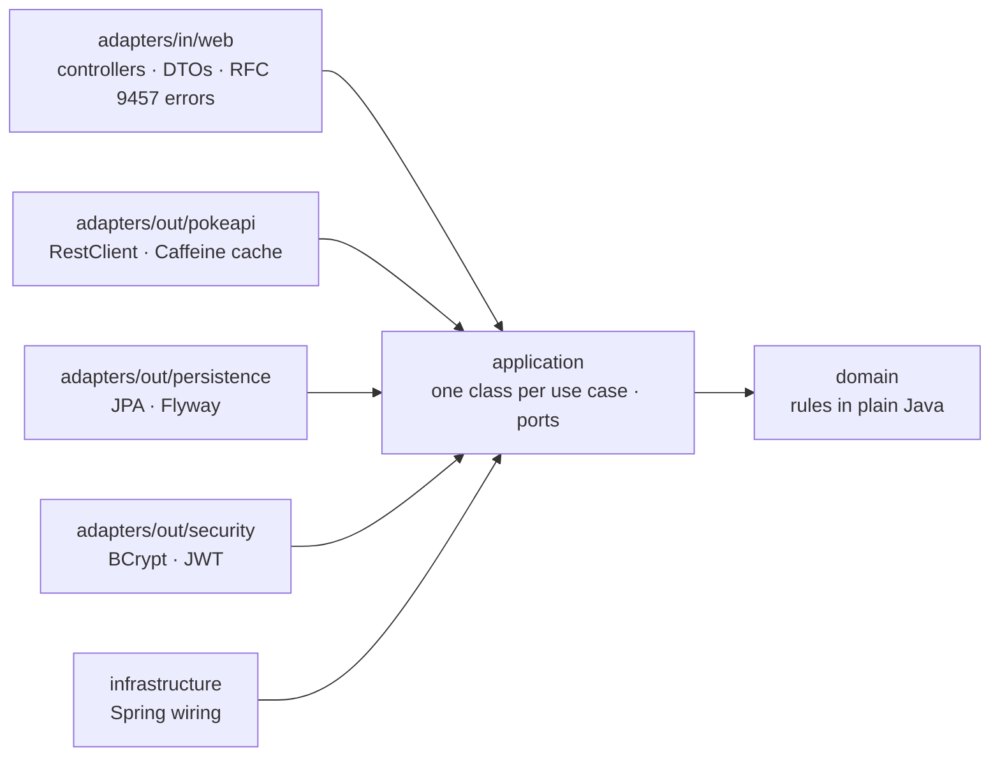

# Pokémon Challenge — Spring Boot + React

Full-stack application that integrates with [PokeAPI](https://pokeapi.co/docs/v2) to **browse** Pokémon,
show **detailed** data, **replicate** them into a local PostgreSQL database and **enrich/edit** them with
proprietary fields — built with **Clean Architecture** and **TDD**.

## Contents
- [User stories → implementation](#user-stories--implementation)
- [Architecture](#architecture)
- [Quick start](#quick-start)
- [Demo credentials](#demo-credentials)
- [API](#api)
- [Testing](#testing)
- [GenAI and how AI was used](#genai-and-how-ai-was-used)
- [Thought process & trade-offs](#thought-process--trade-offs)

## User stories → implementation
| Story | What it does | Endpoint(s) | Frontend |
|---|---|---|---|
| US01 Enumeration | Paginated list with sprite, category, mass (kg), skills (cached) | `GET /api/pokemon?page=0&size=20` (public) | `/pokedex?page=1` |
| US02 Detailed view | Official artwork, 6 core stats + total, English description, evolution tree with branches and conditions | `GET /api/pokemon/{id}` (public) | `/pokedex/{id}` |
| US03 Synchronization | Idempotent replication into PostgreSQL; proprietary fields (localized name, region, habitat, tags, notes) survive re-syncs | `POST /api/local-pokemon` (signed in), `GET /api/local-pokemon[/{id}]` (public) | "Add to the collection" on `/pokedex/{id}`; "Team collection" at `/collection`, `/collection/{id}` |
| US04 Local modification | Replace proprietary data with optimistic locking; delete (ADMIN) | `PUT /api/local-pokemon/{id}` (signed in), `DELETE …/{id}` (ADMIN) | Edit form and Delete (with confirmation) on `/collection/{id}` |

## Architecture
**System:** React (nginx, `:3000`) → `/api` → Spring Boot (`:8080`) → PostgreSQL 17, and → PokeAPI over HTTPS.

**Backend: Clean / Hexagonal** ([ADR-002](docs/DECISIONS.md)). Arrows mean "depends on"; they only point inward.



- **domain**: Pokémon, evolution tree, local replica, user, and their rules. No Spring, JPA or Jackson.
- **application**: use cases (`ListPokemon`, `SyncPokemon`, `UpdateLocalPokemon`, …) and the ports they need
  (`PokemonCatalog`, `LocalPokemonRepository`, `PasswordHasher`, `TokenIssuer`, …). Also framework-free; the use
  cases are plain classes that `infrastructure` instantiates.
- **adapters** implement the ports (PokeAPI client, JPA repositories, BCrypt, JWT) or call the use cases (REST).
  PokeAPI's JSON never leaves `adapters/out/pokeapi`: it is mapped to domain objects at the boundary.

**The dependency rule is tested, not just drawn.** `ArchitectureTest` fails `./mvnw test` if a layer depends
outward, if `domain` or `application` import a framework, or if a controller reaches an outbound adapter directly.
`ArchitectureRulesTest` runs the same rules against deliberately broken fixture code, to prove each rule really
catches its violation.

## Quick start
Prerequisites: Docker (Desktop) with Compose v2. Nothing else — no Java, Node or `.env` needed.

```bash
git clone https://github.com/MarinoGNeto/pokemon-challenge.git && cd pokemon-challenge
docker compose up --build
```

| What | URL |
|---|---|
| App | http://localhost:3000 |
| API | http://localhost:8080/api/pokemon |
| Swagger UI | http://localhost:8080/swagger-ui.html |
| Health | http://localhost:8080/actuator/health |

The first build takes a few minutes (Maven and npm downloads); later builds reuse the caches. Sign in with the
[demo credentials](#demo-credentials). The database starts with 12 Pokémon and the two demo users; the Pokédex itself
needs internet access (it reads PokeAPI live). `docker compose down` stops everything; add `-v` to also delete the
database volume and start from the seed again.

| Service | Image | Notes |
|---|---|---|
| `postgres` | `postgres:17-alpine` | published on `127.0.0.1:5432` only, for running the backend outside Docker |
| `backend` | `backend/Dockerfile` — Maven/JDK 21 build → layered JRE 21 runtime | non-root; healthy when `/actuator/health` (incl. the database) is UP |
| `frontend` | `frontend/Dockerfile` — Node 24 build → unprivileged nginx | serves the bundle with an SPA fallback and proxies `/api` to the backend (one origin, no CORS) |

Each service starts when the previous one is healthy. Ports and credentials can be changed in an optional `.env`
(copy `.env.example`): `FRONTEND_PORT`, `BACKEND_PORT`, `POSTGRES_PORT`, `POSTGRES_*`, and `JWT_SECRET` (without it,
tokens are signed with a random key and do not survive a backend restart). The image builds only package; tests run as
described in [Testing](#testing).

### Local development (backend)
Prerequisites: Java 21, Docker. Maven is not needed — use the wrapper.

```powershell
docker compose up -d postgres        # PostgreSQL 17 on localhost:5432 (demo credentials, see .env.example)
cd backend
.\mvnw.cmd spring-boot:run           # Windows   (macOS/Linux: ./mvnw spring-boot:run)
# Health: http://localhost:8080/actuator/health -> {"status":"UP","components":{"db":{"status":"UP"},...}}
```

Alternative without compose: `.\mvnw.cmd spring-boot:test-run` starts the app with a throwaway Testcontainers
PostgreSQL (`TestPokemonApiApplication`).

Optional: `$env:JWT_SECRET = "<at least 32 bytes>"` keeps tokens valid across restarts (see `.env.example`).

### Local development (frontend)
Prerequisites: Node 22.22+ (24 LTS recommended) and the backend running on `:8080`.

```powershell
cd frontend
npm ci
npm run dev        # http://localhost:5173 — /api is proxied to http://localhost:8080 (no CORS needed)
npm test           # Vitest + Testing Library + MSW
npm run lint       # oxlint (warnings fail)
npm run build      # type-check + production build
```

**Frontend design.** React 19 + TypeScript + Vite; React Router 8 (page numbers live in the URL, so Back and shared
links work); TanStack Query for all server state (catalogue cached 10 min in the browser, previous page kept on
screen while the next loads, no retries on 4xx); feature folders (`features/pokedex`, `features/collection`,
`features/auth`), shared UI in `shared/ui`, one CSS Module per component on top of design tokens. Every error shows
the server's RFC 9457 title and detail; field errors from the server land on the matching input.

Signing in (`/login`, `/register`) keeps the session in memory + sessionStorage and always returns to the page you
came from (e.g. "Sign in to add Eevee to the collection" → back on Eevee). Forms use React Hook Form + Zod with the
backend's own rules (username format, password 8 chars–72 bytes, tag format, lengths), so most mistakes are caught
before a request; a 409 on save offers to load the latest version; a 401 signs you out with an explanation. Delete
is shown to admins only and asks for confirmation (focus on Cancel, Escape closes). Visual direction "field device readout": cool neutral surfaces, one brand red
for the mark and primary actions, Pokémon type colours as the only other colour (they always carry information),
Barlow Condensed for names/numbers/stats and Atkinson Hyperlegible for text (self-hosted). The evolution tree is drawn
as a branching diagram on wide screens and an indented tree on phones.

**Zero console warnings.** `npm run check:browser` (Playwright; `npx playwright install chromium` once) opens every
page at 375 and 1280 px against a running stack (`BASE_URL`, default the dev server on :5173; use
`http://localhost:3000` for the Docker stack), walks the signed-in journey with the demo admin (sign in from a
Pokémon page and come back, add, edit, a validation error, delete with confirmation), and fails on any console
warning or error. The only line it
expects is Chrome's own network log for `/pokedex/99999`, a deliberately unknown Pokémon: the API correctly answers
404 and Chrome logs every non-2xx response — page code cannot suppress that line.

## Demo credentials
Seeded by Flyway (`V4__seed_demo_users.sql`). **Demo-only** — never reuse these anywhere.

| Username | Password | Role | Can |
|---|---|---|---|
| `admin` | `Admin#2026` | ADMIN | everything, including deleting local Pokémon |
| `user` | `User#2026` | USER | sync and edit local Pokémon |

Anyone can also register (`POST /api/auth/register`); self-registered accounts are always USER.
In Swagger UI: `POST /api/auth/login` → copy `accessToken` → **Authorize** → paste.

## API
Interactive docs: http://localhost:8080/swagger-ui.html (OpenAPI JSON at `/v3/api-docs`).

| Method & path | Auth | Success | Errors |
|---|---|---|---|
| `POST /api/auth/register` `{"username","email","password"}` | public | 201 user (never the password) | 400 per-field / unknown field (e.g. `role`), 409 already registered |
| `POST /api/auth/login` `{"username","password"}` | public | 200 `{"accessToken","tokenType":"Bearer","expiresAt","username","role"}` | 400, 401 invalid credentials |
| `GET /api/auth/me` | signed in | 200 `{"username","roles"}` | 401 |
| `GET /api/pokemon?page=0&size=20` | public | 200 page of summaries | 400 invalid paging, 502 PokeAPI unavailable |
| `GET /api/pokemon/{id}` | public | 200 details with evolution tree | 400 invalid id, 404 unknown Pokémon, 502 PokeAPI unavailable |
| `GET /api/local-pokemon?page=0&size=20` | public | 200 page of local Pokémon | 400 invalid paging |
| `GET /api/local-pokemon/{id}` | public | 200 local Pokémon (`catalog` + `proprietary` + `version`) | 400, 404 |
| `POST /api/local-pokemon` `{"pokeApiId":25}` | signed in | 201 + `Location` (created) / 200 (refreshed) | 400, 401, 404 unknown in PokeAPI, 409 concurrent sync, 502 |
| `PUT /api/local-pokemon/{id}` `{"version":0, "localizedName", "region", "habitat", "tags", "notes"}` | signed in | 200 | 400 (per-field errors, unknown fields, malformed JSON), 401, 404, 409 stale version |
| `DELETE /api/local-pokemon/{id}` | ADMIN | 204 | 401, 403, 404 |

Paginated responses share one envelope: `{"items": [...], "page", "size", "totalElements", "totalPages"}`.
Errors are RFC 9457 `application/problem+json` with `type` (`urn:pokemon-challenge:problem:*`), `title`, `status`,
`detail`, `instance` and, for validation, `errors: [{"field", "message"}]`. Stack traces and internal messages are
never returned.

**Authentication (ADR-008).** Stateless JWT (HS256) issued by `/api/auth/login`, valid 1 h, verified by Spring
Security's resource server; the `roles` claim drives `hasRole(...)`. Reads are public, writes need a token, deletes
need ADMIN. 401 and 403 are problem bodies too, with the RFC 6750 `WWW-Authenticate: Bearer` challenge. The signing
secret comes from `JWT_SECRET` (≥ 32 bytes) and is never committed; without it the app uses a random key per start.
Passwords are BCrypt-hashed, limited to 72 bytes (BCrypt ignores the rest), and login gives the same answer — in the
same time — for an unknown user and a wrong password.

**Local replica (US03/US04).** A local Pokémon has two parts with different owners: `catalog` is copied from
PokeAPI on every sync and is read-only through the API (sending `name` in a PUT is a 400 "not an editable field");
`proprietary` is ours and survives re-syncs. Updates must carry the `version` that was read; a stale one is a 409
(checked by the domain and again by the database via JPA `@Version`). The database starts with Pokémon #1–#12
(Flyway seed generated from real PokeAPI data; proprietary values are demo data).

**Caching and fan-out (US01).** PokeAPI's list endpoint returns only names, so a page of 20 needs 41 calls
(list + 20 Pokémon + 20 species). They run in parallel on virtual threads, capped at 20 concurrent PokeAPI calls
across all users, and every response is cached for 24 h (Caffeine). Measured against the live PokeAPI:
first page **1.2 s**, same page again **12 ms**.

## Testing
Results of a fresh run from a clean clone on 2026-10-10:

| Where | Command | What runs | Result |
|---|---|---|---|
| `backend/` | `.\mvnw.cmd test` | Unit and slice tests (`*Test`), incl. the ArchUnit rules. No Docker needed | 134 passed |
| `backend/` | `.\mvnw.cmd verify` | The above + integration tests (`*IT`) against Testcontainers PostgreSQL, with PokeAPI stubbed by WireMock; merged coverage report. Needs Docker | 25 passed · coverage **98% lines, 84% branches** |
| `frontend/` | `npm test` | Vitest + Testing Library + MSW | 51 passed |
| `frontend/` | `npm run lint` · `npm run build` | oxlint (warnings fail) · type-check + production build | clean |
| `frontend/` | `npm run check:browser` | Playwright: every page at 375 and 1280 px plus the signed-in journey; fails on any console warning | needs a running stack ([details](#local-development-frontend)) |

- Coverage report (unit + integration merged): `backend/target/site/jacoco-merged/index.html`.
- **Architecture is tested** by `ArchitectureTest` and `ArchitectureRulesTest` (see [Architecture](#architecture)).
- **TDD in the history:** red tests are committed as `test: … (red)` before the `feat:` commit that makes
  them green; see `git log --oneline`.

## GenAI and how AI was used
**Exercise ([`genai-exercise/`](genai-exercise/README.md)).** One prompt generated a task-management API; the raw
output is committed untouched. A strict review found 26 issues (one High: a JWT signing secret committed as a
fallback); 4 were fixed test-first, one commit each, and the rest are documented with the fix they would need.
One finding of the AI review itself turned out to be false. Two mutation tests disproved it, so it was withdrawn
instead of "fixed".

**How AI was used on this project.** Claude Code wrote most of the code and tests. I set the architecture and the
stack, approved or amended every decision (the AI drafted the ADRs as *Proposed*; [`DECISIONS.md`](docs/DECISIONS.md)
records what I changed), steered each step, reviewed the results and required them to be verified: tests first,
then a real run, before moving on. The step-by-step log, with what was rejected or corrected and why, is
[`docs/AI_USAGE.md`](docs/AI_USAGE.md); the guard-rails given to the AI are in [`CLAUDE.md`](CLAUDE.md) and the
session's opening prompt in [`docs/KICKOFF_PROMPT.md`](docs/KICKOFF_PROMPT.md).

## Thought process & trade-offs
**Reading the stories.** The challenge names fields PokeAPI doesn't have, so each was mapped explicitly
([ADR-006](docs/DECISIONS.md)): *category* is the species genus ("Seed Pokémon"), *mass* is `weight` converted to
kg, *skills* are abilities. "Full CRUD" over data that PokeAPI owns was read as: **create = sync from PokeAPI**,
then read, update and delete our copy. A local Pokémon is split into `catalog` (PokeAPI's, read-only, refreshed on
every sync) and `proprietary` (ours, editable, kept across re-syncs), so the API makes the ownership visible.

**Decisions and their price.**
- *Clean Architecture* costs mapping boilerplate (DTO ↔ domain ↔ JPA). Accepted, because it is what keeps the
  business rules independent of the API and the database, which the challenge asks for, and ArchUnit keeps it so.
- *PostgreSQL + Testcontainers, no H2*: integration tests run against the real database dialect; the price is
  that `verify` needs Docker. The unit suite (`./mvnw test`) runs without it.
- *PokeAPI is slow per page*: its list endpoint returns only names, so a page of 20 needs 41 calls. They run in
  parallel on virtual threads, capped at 20 concurrent calls, and every response is cached for 24 h:
  first page 1.2 s, the same page again 12 ms.
- *Optimistic locking* (`version` in the PUT body → 409) instead of last-write-wins, so two editors can't
  silently overwrite each other.
- *JWT with zero setup*: without `JWT_SECRET` the backend signs with a random key per start, so the reviewer
  needs no `.env`; the price is that tokens don't survive a restart. No secret is ever committed.
- *Seed data* (Pokémon #1–#12 and two demo users) so the demo works even if PokeAPI is slow.

**Cut on purpose** ([ADR-012](docs/DECISIONS.md)), to finish the must-haves well before the deadline: `PATCH`,
an admin bulk sync, syncing the first 151 Pokémon on startup (it would hit PokeAPI on every fresh start) and
MapStruct (mappers are hand-written and unit-tested). Also out of scope: refresh tokens, logout/revocation and
login rate limiting.

**With more time:** login rate limiting and refresh tokens; `PATCH` for partial updates; search and type filters
in the Pokédex; and the remaining UI items in the [polish backlog](docs/PLAN.md#polish-backlog-later--not-part-of-the-current-stops).
